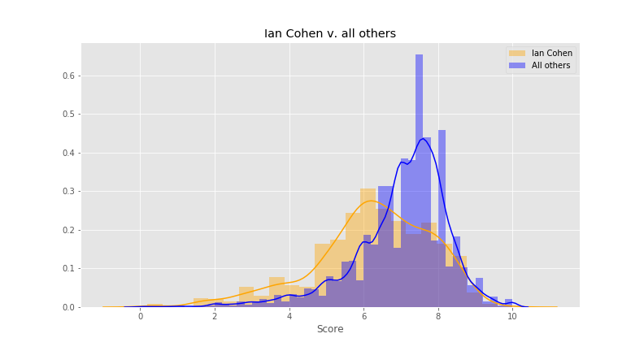

# Pitchfork review analysis

Project w/ [Laura E Shummon Maass](https://github.com/Laura-ShummonMaass)

* [Complete testing and workflow (Jupyter Notebook)](Music_Index.ipynb)
* [Custom functions created (Python)](pitchfork_functions.py)
* [Scraping Process (Jupyter Notebook)](pitchfork_scrape.ipynb)
* [Presentation (Google Slides)](https://docs.google.com/presentation/d/1nQlVcRtLkopujbedojTzSGsPWeMfU-rk8DdmdldPX6E/edit?usp=sharing)

## Overview
* Using a dataset of reviews from Pitchfork, our goal was to answer 4 hypothesis statements about the data to provide deeper analysis of how a hypothetical artist could approach how the particular categorization and reviewer may effect their score.

### Hypothesis Test #1: Pop/R&B vs Electronic album Ratings

* **Null:** There is no statistically significant difference between the reviews for Pop/R&B albums and Electronic music albums.
* **Alternative:** The reviews for Pop/R&B albums and Electronic albums have a statistically significant difference between how they are reviewed, either positively or negatively.

* **Findings:**
* The distribution of ratings for both Pop & Electronic lined up very closely: 

* The sample means were very close (less than a 0.16 difference in avg rating)
* And the t-stat was below 0.37  (-0.3642)
* The p-value came to 0.7157 which far exceeded our threshold of 0.05
* We also did a bootstrap test and found:
    * Almost identical standard deviations for both samples
    * Almost identical 2.5 and 97.5 mean percentiles for both samples
* With all of the evidence above we accepted our null hypothesis that there is no statistically significant difference between the rating of Pop/R&B and Electronic albums.

### Hypothesis Test #2: Album Genres with Best and Worst Reviews 

* **Null:** In sampling the 500 worst and 500 best reviewed albums, there is no statistically significant difference in the genres each represents with regards to score. 
* **Alternative:** The 500 worst reviewed and 500 best reviewed albums have a statistically significant difference in the genres they have. 

* **Findings:**
* Conducted an ANOVA test on the 500 best & worst reviewed albums.
* We found trends amoung genres in the 500 best reviewed albums, but no trends emerged in the worst reviewed.
* In the 500 best reviewed albums, pop/r&b and rap had p-values of 0.0013 and 0.026 respectively. Rock had a p-value of 0.0546
* Based on the 3 lowest p-value genres, we reject the null for pop & rap, but not for rock (since it doesn't meet our 0.05 cutoff)
    * Pop & Rap genres in the top 500 albums have a statistically significant difference in review score compared to other genres.

### Hypothesis Test #3: Top Reviewer Ratings

* **Null Hypothesis:** There is no statistical difference between the top album reviewers and all others.
* **Alternative:** Top album reviewers have a statistically significant different in their review scores. 

* **Findings:**
* Viewed distributions of the top 5 reviewers (in terms of volume) for pop and electronic: 

* 1 stood out for both genres: Ian
* Mark stood out for Rock, but only had a slight differnce for Pop and Electronic.
* Compared Ian to Joe AND compared Mark to Joe:
     * Ian had a statistically significant difference from Joe
     * Mark had a slight difference, but it was not statistically significant

### Hypothesis Test #4: Self-Released vs Label Ratings

* **Null:** There is no statistically significant difference between self-released album ratings and all others. 
* **Alternative:** Self-released albums have a statistically significant decrease in ratings compared to other labels.

* **Findings:**
* The distribution of ratings between self-released albums and albums with labels is not quite as closely lined up as pop and electro ratings, however they still overlap quite well: 
* The sample means had a difference in rating of 0.09 
* However, the t-stat was -1.44 
* Our p-value was also much lower at 0.1499. This still exceeds our threshold of 0.05
* With the evidence above, we accepted our null hypothesis that there is no statistically significant difference between self-released album ratings and albums with labels. 
